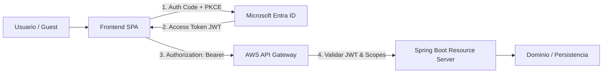

# Documentación Semana 4 · Integración Full Stack y Seguridad IDaaS

**Asignatura:** DSY1107 Desarrollo Cloud Native I

**Sección:** DSY1107-003D

**Estado:** Integración Backend + Cierre de Identidad y Acceso

---

## 1. Resumen del Trabajo Realizado

Durante esta jornada intensiva de trabajo, logramos conectar y proteger la arquitectura Full Stack del proyecto:

* **Persistencia y Backend:** Configuración y puesta a punto del backend en Spring Boot, asegurando las capas de Controller, Service y Repository.

* **Integración con IDaaS:** Configuración de Microsoft Entra ID para la gestión de usuarios internos (Members) y usuarios externos (Guests).

* **Seguridad en la API:** Implementación de flujos de autenticación OAuth2 / OIDC con Authorization Code + PKCE para cliente público (SPA), emitiendo tokens de acceso para la API protegida.

* **Control de Acceso y Gateway:** Preparación de la API para su consumo a través de AWS API Gateway y protección mediante comprobación de firma JWT, `issuer`, `audience` y `scopes`.

---

## 2. Arquitectura de Seguridad Implementada

---

## 3. Matriz de Cobertura Técnica (Semana 4)

| Componente | Configuración / Implementación | Estado |
| --- | --- | --- |
| **Identity Provider** | Microsoft Entra ID (Tenant Workforce / B2B)

 | Completado |
| **Frontend** | MSAL Config (Single-page Application, Public Client sin client_secret)

 | Completado |
| **Backend** | Spring Boot Resource Server validando JWT

 | Completado |
| **API Gateway** | JWT Authorizer con validación de `iss`, `aud` y `scp` (`api.read`)

 | Completado |
| **Usuarios** | Flujo de incorporación de Members y Guests externos

 | Completado |

---

## 4. Matriz de Pruebas y Evidencia de Seguridad

| ID | Escenario de Prueba | Comportamiento Esperado | Resultado |
| --- | --- | --- | --- |
| **SEC-01** | Petición a endpoint público | Código `200 OK` |  |
| **SEC-02** | Petición a endpoint protegido sin token | Código `401 Unauthorized`  |  |
| **SEC-03** | Token con `audience` o `issuer` incorrecto | Código `401 Unauthorized`  |  |
| **SEC-04** | Token válido pero con scopes insuficientes | Código `403 Forbidden`  |  |
| **SEC-05** | Token válido + scope correcto (`api.read`) | Código `200 OK` / `201 Created`  |  |

---

## 5. Próximos Pasos y Checkpoint

* [x] Conexión Frontend SPA $\rightarrow$ API Gateway $\rightarrow$ Spring Boot.

* [x] Validación de tokens JWT en el backend.

* [ ] Cargar última evidencia sanitizada al DevLog sin exponer secretos ni tokens.

* [ ] Preparación final del proyecto base para la **Evaluación Parcial 1 (EV1)**.

---